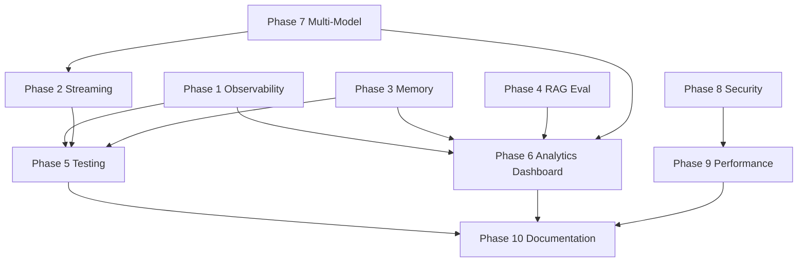

# OmniAI Production Platform — Implementation Plan

**Last updated:** 2026-05-25  
**Stack:** Next.js · FastAPI · PostgreSQL · ChromaDB · Groq · Railway + Vercel

This plan maps the requested 10 phases against the **current codebase**, defines safe execution order, and lists affected files. Work proceeds in **small, backward-compatible commits** per phase.

---

## Executive Summary

| Area | Current State | Target |
|------|---------------|--------|
| Streaming chat | **Done** — NDJSON `/chat-stream`, Groq token stream | Extend to all agent paths + cancellation |
| Conversations / memory | **Done** — `chat_sessions`, `messages`, `user_memories` | LLM summarization, windowing, delete API |
| RAG pipeline | **Done** — hybrid search, rerank, session docs | Eval pipeline + quality dashboard |
| Observability | **Partial** — trace IDs, spans, LangSmith env only | Full LangSmith + DB analytics tables |
| Security | **Partial** — JWT, CORS, in-memory rate limit | Redis limiter, injection detection, audit log |
| Testing | **Partial** — ~27 unit tests | 80%+ coverage, integration + CI |
| Analytics UI | **Mock** — dashboard placeholders | Recharts + real aggregation APIs |
| Multi-model | **Partial** — single global provider | ModelRouter + admin settings |
| Documentation | **Minimal** — README stub, testing docs | Full architecture + deployment guides |

**Railway safety rules (all phases):**
- Migrations are additive only; auto-run on startup remains optional-fail-safe
- New features gated by env vars (`LANGCHAIN_TRACING_V2`, `ENABLE_USAGE_TRACKING`)
- No breaking changes to existing OAuth, `/chat-stream` NDJSON contract, or env var names
- Streaming middleware stays pure ASGI (no `BaseHTTPMiddleware`)

---

## Phase Dependency Graph

---

## Phase 1 — Observability & Monitoring

### Current state
| Component | Status |
|-----------|--------|
| `LANGCHAIN_*` env vars | Done in `app_settings.py` |
| `configure_langsmith_env()` | Done at startup |
| `TraceMiddleware` | Done — `X-Trace-Id`, `X-Response-Time-Ms` |
| `traced_span()` | Done — orchestrator, RAG |
| `maybe_trace_llm_call()` | **Broken** — noop, never called from LLM path |
| Token / model usage logging | **Missing** |
| Analytics DB tables | **Missing** |

### Work items
1. Add `api_usage`, `model_usage`, `token_usage` tables (Alembic `20260525_0003`)
2. Create `usage_tracking_service.py` — non-fatal DB writes
3. Create `llm_invoke.py` — central LLM calls with latency, tokens, LangSmith
4. Extend `TraceMiddleware` → record `api_usage` per request
5. Instrument: `chat_routes`, `rag_service`, `orchestrator`, `upload_routes`, `documents_services`
6. Add `ENABLE_USAGE_TRACKING` env (default `true`)
7. Docs: `doc/monitoring/langsmith-setup.md`, `doc/monitoring/observability.md`

### Affected files
- `backend/app/models/analytics.py` *(new)*
- `backend/alembic/versions/20260525_0003_analytics_tables.py` *(new)*
- `backend/app/services/usage_tracking_service.py` *(new)*
- `backend/app/services/llm_invoke.py` *(new)*
- `backend/app/core/telemetry.py`
- `backend/app/core/llm.py` — Groq `stream_options.include_usage`
- `backend/app/middleware/production.py`
- `backend/app/api/chat_routes.py`
- `backend/app/api/upload_routes.py`
- `backend/app/services/rag_service.py`
- `backend/app/services/title_service.py`
- `backend/app/services/summary_service.py`
- `backend/app/main.py`
- `backend/.env.example`, `backend/railway.env.example`
- `backend/tests/test_usage_tracking.py` *(new)*

### Migration notes
- Additive tables only; no changes to existing columns
- Safe for Railway auto-migrate on deploy

### Suggested commits
1. `feat(obs): add analytics tables migration`
2. `feat(obs): usage tracking service + LLM invoke wrapper`
3. `feat(obs): wire LangSmith and middleware`
4. `docs(obs): monitoring setup guide`

---

## Phase 2 — Streaming Responses

### Current state
**Mostly done.** `/chat-stream` uses `StreamingResponse`, async generator, Groq `stream=True`, frontend `useChatStream`.

### Gaps
| Gap | Action |
|-----|--------|
| Legacy `/chat` non-streaming | Deprecate or redirect to stream internally |
| No cancellation | Add client disconnect detection in generator |
| RAG-only path | Already streams via `stream_response` |
| Frontend retry | Partial — add explicit retry button state |
| SSE alternative | Keep NDJSON (breaking change avoided) |

### Affected files
- `backend/app/api/chat_routes.py`
- `backend/app/services/rag_service.py`
- `frontend/hooks/useChatStream.ts`
- `frontend/app/chat/page.tsx`

### Suggested commits
1. `feat(stream): client disconnect cancellation`
2. `feat(stream): error recovery + retry UX`

---

## Phase 3 — Conversational Memory

### Current state
**Mostly done.** PostgreSQL stores sessions + messages; sidebar lists/switches sessions.

### Gaps
| Gap | Action |
|-----|--------|
| `conversation_summaries` | Replace truncation with LLM summarization |
| Memory windowing | Configurable window in `conversation_service` |
| Session delete | Add `DELETE /sessions/{id}` + frontend wiring |
| Pin/folder | Optional — client-only or new columns |

### Affected files
- `backend/app/api/session_routes.py`
- `backend/app/services/memory_summary_service.py`
- `backend/app/services/conversation_service.py`
- `frontend/app/chat/page.tsx`
- `frontend/lib/api.ts`

### Migration notes
- Optional: `chat_sessions.updated_at`, `pinned` columns

---

## Phase 4 — RAG Evaluation Pipeline ✅

**Status:** Implemented (2026-05-30)

- Package: `backend/evaluation/` (metrics, runner, exporters, sample dataset)
- API: `POST /evaluation/run`, `GET /evaluation/datasets/sample`
- Metrics: faithfulness, answer relevancy, context precision/recall, hallucination, response quality
- Engines: RAGAS → DeepEval → heuristic fallback
- Reports: JSON + CSV in `eval/reports/`
- Docs: `doc/evaluation/rag-evaluation.md`
- Admin gate: `EVAL_ADMIN_EMAILS` in production

---

## Phase 5 — Testing

### Current state
27 pytest tests; no frontend tests; no coverage in CI.

### Work items
1. Integration tests: auth, chat-stream, upload, sessions (httpx + TestClient)
2. Factory fixtures (`factory_boy`) for User, Session, Message
3. CI: `pytest --cov=app --cov-fail-under=80`
4. Frontend: Playwright smoke (optional sub-phase)

### Affected files
- `backend/tests/*`
- `backend/tests/factories.py` *(new)*
- `.github/workflows/ci.yml`
- `backend/requirements-dev.txt`

---

## Phase 6 — Analytics Dashboard

### Current state
Mock dashboard at `frontend/app/dashboard/page.tsx`.

### Work items
1. `GET /analytics/overview` — aggregate from `api_usage`, `model_usage`, `token_usage`
2. `GET /analytics/users`, `/analytics/rag` sub-endpoints
3. Frontend: Recharts, replace mock data
4. Admin gate (env `ADMIN_EMAILS` or role column)

### Depends on Phase 1 tables.

---

## Phase 7 — Multi-Model Routing

### Current state
Single `LLM_PROVIDER` + one model per provider. Agent routing is rule-based, not model-based.

### Work items
1. `ModelRouter` service — mode/intent → provider + model
2. Extend `llm.py` with multi-provider registry
3. Env: `GROQ_FAST_MODEL`, `DEEPSEEK_API_KEY`, etc.
4. Admin model settings page (frontend)
5. Pass `model` from frontend or derive from `mode`

### Affected files
- `backend/app/services/model_router.py` *(new)*
- `backend/app/core/llm.py`
- `backend/app/core/app_settings.py`
- `frontend/app/settings/page.tsx`

---

## Phase 8 — Security Hardening

### Current state
JWT, CORS, security headers, in-memory rate limit, sanitization.

### Work items
1. SlowAPI or Redis-backed limiter (per-user + per-IP)
2. Prompt injection heuristics in `sanitize.py`
3. Audit log table + middleware
4. Stricter Pydantic request models for chat/upload

### Affected files
- `backend/app/middleware/production.py`
- `backend/app/core/sanitize.py`
- `backend/requirements.txt` — `slowapi`

---

## Phase 9 — Performance

### Work items
1. Async SQLAlchemy (major — defer until test coverage)
2. Redis: rate limit, retrieval cache, embedding cache
3. Background jobs for ingestion (Celery/ARQ or FastAPI BackgroundTasks)
4. Frontend: dynamic imports, Suspense on chat subcomponents

### Affected files
- `docker-compose.yml` — wire Redis
- `backend/app/services/retrieval_cache.py`

---

## Phase 10 — Documentation

### Deliverables
| Doc | Path |
|-----|------|
| Architecture diagram | `doc/architecture.md` |
| API reference | `doc/api.md` + OpenAPI export |
| Deployment | `doc/deployment/railway-vercel.md` |
| Environment variables | `doc/environment.md` |
| Developer setup | `doc/development.md` |
| RAG architecture | `doc/rag-architecture.md` |
| Database schema | `doc/database-schema.md` |
| README | root `README.md` |

---

## Execution Schedule (Recommended)

| Sprint | Phases | Rationale |
|--------|--------|-----------|
| 1 | **Phase 1** | Foundation for analytics, debugging production |
| 2 | Phase 2 + 3 gaps | High user-visible value, low risk |
| 3 | Phase 5 (core) | Safety net before larger refactors |
| 4 | Phase 4 + 6 | Eval + dashboard consume Phase 1 data |
| 5 | Phase 7 + 8 | Model routing + security |
| 6 | Phase 9 + 10 | Optimization + docs |

---

## Risk Register

| Risk | Mitigation |
|------|------------|
| Railway migration failure | Keep migrations additive; startup continues on failure |
| LangSmith overhead | Gate with `LANGCHAIN_TRACING_V2=false` default |
| Usage DB writes slow requests | Fire-and-forget with try/except; optional disable |
| 80% coverage blocks CI | Ramp: 50% → 65% → 80% over Phase 5 |
| Multi-model breaks Groq prod | Default router returns current single-provider behavior |

---

## Next Step

**Phase 1 implementation is in progress.** See `doc/monitoring/` for setup guides after completion.
