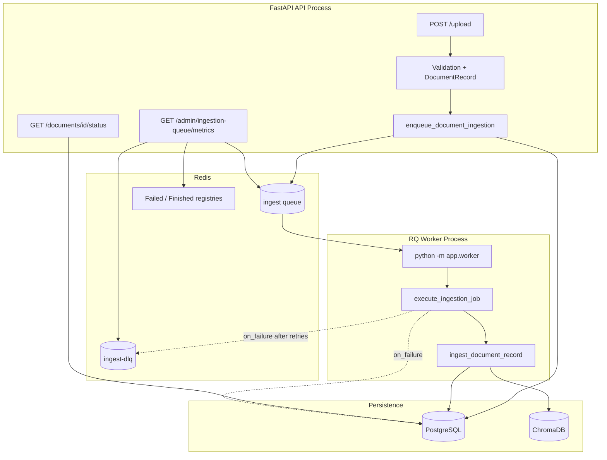

# Sprint 1: Durable Ingestion Queue Architecture

## Overview

Document ingestion moves from **in-process FastAPI BackgroundTasks** to **Redis + RQ** (Redis Queue). Jobs survive API restarts, support configurable retries, and land in a dead-letter queue (DLQ) after exhaustion.

## Current Flow (Audited)

```
Upload (POST /upload)
  → validate_document_upload + scan_uploaded_file
  → DocumentRecord (indexing_stage=queued)
  → [DISPATCH]
       ├─ RQ (production): enqueue execute_ingestion_job
       ├─ BackgroundTasks (rollback): run_ingest_document_record
       └─ Sync (dev): run_ingest_document_record inline
  → ingest_document_record
       → loading: load_document_parts
       → chunking: chunk_document_parts
       → embedding: encode_texts (OpenAI / HF / local)
       → vector_store: Chroma collection.add (batched)
       → finalizing: mark_indexing_ready
  → Frontend polls GET /documents/{id}/status (1.2s interval)
```

## Target Architecture



## Components

| Component | Path | Role |
|-----------|------|------|
| Redis client | `app/core/redis_client.py` | Shared connection |
| Queue service | `app/services/ingestion_queue.py` | Enqueue, metrics, DLQ, requeue |
| Job functions | `app/jobs/ingestion_jobs.py` | RQ-callable workers |
| Worker entry | `app/worker.py` | `python -m app.worker` |
| Monitoring API | `app/api/queue_routes.py` | Admin metrics + DLQ |
| Ingestion core | `app/services/ingestion_service.py` | Unchanged pipeline, `propagate_errors` for RQ |

## Dispatch Modes

| `INGEST_IN_BACKGROUND` | `INGEST_QUEUE_ENABLED` | `REDIS_URL` | Behavior |
|------------------------|------------------------|-------------|----------|
| `false` | any | any | Sync ingest in API request |
| `true` | `true` | set | **RQ queue (production)** |
| `true` | `false` | any | Legacy BackgroundTasks (rollback) |

## Status Stages (unchanged)

`queued` → `loading` → `chunking` → `embedding` → `vector_store` → `finalizing` → `ready`  
Any stage may transition to `failed`.

## Retry & DLQ

- **Retries:** `INGEST_JOB_MAX_RETRIES` (default 3), intervals `30,60,120` seconds
- **Job timeout:** 30 minutes (`JOB_TIMEOUT_SECONDS`)
- **On exhaustion:** `on_ingestion_job_failure` → DLQ entry + `mark_indexing_failed`
- **Recovery:** `POST /admin/ingestion-queue/requeue/{job_id}`

## Structured Logs

| Event | Fields |
|-------|--------|
| `[INGEST_RQ_ENQUEUED]` | job_id, document_id, queue |
| `[INGEST_JOB_START]` | job_id, document_id, pid |
| `[INGEST_JOB_COMPLETE]` | job_id, document_id, duration_ms |
| `[INGEST_JOB_FAILED]` | job_id, document_id, duration_ms, failure_reason |
| `[INGEST_JOB_EXHAUSTED]` | job_id, document_id, failure_reason |
| `[INGEST_DLQ]` | job_id, document_id, failure_reason |

## Frontend Compatibility

No frontend changes required:

- Upload still returns `{ indexing: true, document_id }` for async path
- Status polling unchanged (`GET /documents/{id}/status`)
- Optional new field: `indexing_job_id` in status payload (ignored by UI)

## Monitoring Endpoints (admin)

- `GET /admin/ingestion-queue/metrics` — queue length, active, failed, completed, DLQ
- `GET /admin/ingestion-queue/dlq` — recent dead-letter jobs
- `POST /admin/ingestion-queue/requeue/{job_id}` — operator recovery

Requires admin email in `EVAL_ADMIN_EMAILS` or `ANALYTICS_ADMIN_EMAILS`.
